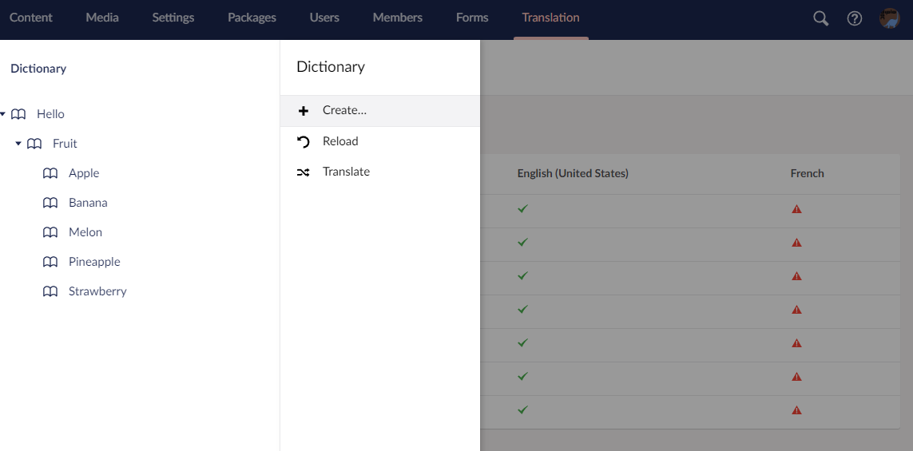
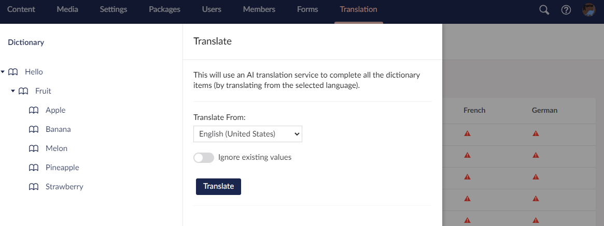

# Diplo Translator for Umbraco

This is package for [**Umbraco 10**](https://umbraco.com/) CMS that adds a `Translate` option to the Umbraco **Dictionary** within the **Translation** tree. This option can be used to automatically translate all the empty dictionary items in the tree from the default language using an AI-based translation service. By default this is [Microsoft Translator](https://www.microsoft.com/en-us/translator/). In future other providers may be supported.

## Set Up

### Microsoft Translator (Azure)

To use this package you will need a [Microsoft Azure subscription](https://azure.microsoft.com/free/cognitive-services/) (which can be set-up for free) and to have created a [Translator resource](https://portal.azure.com/#create/Microsoft.CognitiveServicesTextTranslation) within the Azure Portal. You can use the free pricing tier (F0) for the service which will suffice for most use cases.

Full instructions: https://docs.microsoft.com/en-us/azure/cognitive-services/translator/how-to-create-translator-resource

Once you have done this you will have access to:

* The API endpoint URL of your translator service
* An API key

You will need to configure these settings in the Umbraco site that you have installed the package to. The simplest way to do this is add them to the `appsettings.json` file in Umbraco like this:

```
"Diplo.Translator": {
    "TranslatorApiEndpoint": "https://api.cognitive.microsofttranslator.com/",
    "TranslatorApiKey": "your-api-key-goes-here"
  }
```

You could also set your API credentials as *secrets*, as outlined in the article [Safe storage of app secrets in development in ASP.NET Core](https://docs.microsoft.com/en-us/aspnet/core/security/app-secrets?view=aspnetcore-6.0).

## Usage

Once installed and configured (see above) you will be able to go to the **Translation** section in Umbraco where you find the **Dictionary**. Within here you can right-click on the **`...`** to select the new **Translate** option in the menu dialog:



This will then take you to the translate dialog:



Simply click the **Translate** button and the system will translate **ALL** *empty* dictionary items from the default language (you will need to have added the values for the default language for this to work as it requires some text to translate from). 

**Note:** The default language is the language ticked as `default` in the `Settings > Languages` area of Umbraco.

### For Example

If you have a site with 3 languages: English (default), French and German then you will need to complete the values for all the English dictionary keys. Once you have done that, clicking **Translate** will translate *all* the French and German values using the configured translation service.

* If an item already has a value for a language it will be skipped.

* If an item hasn't had the default language value added for it will be skipped.

**Note:** Whilst Microsoft Translator supports most languages there may be instances where it is not able to translate. See https://www.microsoft.com/en-us/translator/languages/ for supported languages.

## Demo

You can view a video demo at: https://www.youtube.com/shorts/1R8QtCBkyEk

## Get in Touch

You can reach me (Dan 'Diplo' Booth) at:

* Web: https://www.diplo.co.uk/

* Twitter: https://twitter.com/DanDiplo

* Our Umbraco: https://our.umbraco.com/members/DanDiplo/

* Source: https://github.com/DanDiplo/Diplo.Translator

### Credits

The [signalR](https://dotnet.microsoft.com/en-us/apps/aspnet/signalr) code was blatantly "borrowed" and adapted from code the fabulous [Kevin Jump](https://jumoo.co.uk/) wrote for [uSync](https://github.com/KevinJump/uSync). Not only is **uSync** an awesome product, but a great place to learn how to build complex integrations with Umbraco. Thanks, Kevin!


